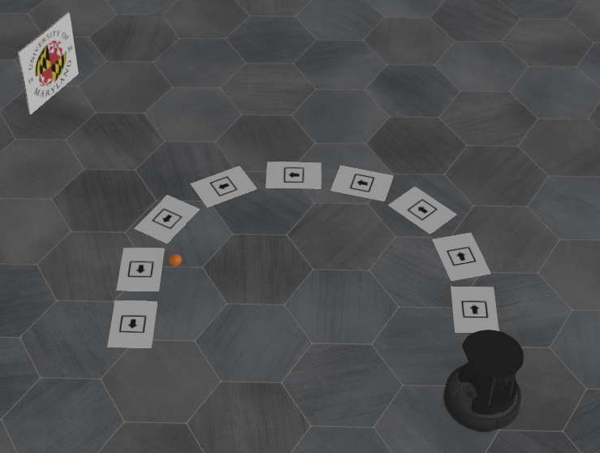

# ENPM673 Turtlebot Perception Challenge

## How to install Webots?

Webots R2025a is required to run this simulation.

``` shell
# Add the Cyberbotics apt repository
wget -qO- https://cyberbotics.com/Cyberbotics.asc | sudo apt-key add -
sudo apt-add-repository 'deb https://cyberbotics.com/debian/ binary-amd64/'
sudo apt update

# Install Webots
sudo apt install webots
```

Alternatively, download the `.deb` installer directly from the [Webots releases page](https://github.com/cyberbotics/webots/releases) and install it:

``` shell
# for R2025a
wget https://github.com/cyberbotics/webots/releases/download/R2025a/webots_2025a_amd64.deb
sudo apt install ./webots_2025a_amd64.deb
```

Also install the ROS2 Webots driver:

``` shell
sudo apt install ros-humble-webots-ros2
```

Verify the installation:

``` shell
/usr/local/webots/webots --version
```

## How to build / install the ROS2 package?

``` shell
# first checkout the git repo
git clone https://github.com/adil275/ENPM673-Final-Project-Simulation.git
cd ENPM673-Final-Project-Simulation/
source /opt/ros/humble/setup.bash
# install perception dependencies
sudo apt install python3-opencv ros-humble-cv-bridge
# build and install the package
colcon build --symlink-install
source install/setup.bash
```

## Once built, how to start the WeBots simulation?

``` shell
ros2 launch tb4_sim tb4_launcher.py
```

This launch file now starts:

- Webots with the TurtleBot 4 simulation world
- The Webots ROS2 driver
- The moving-ball controller used in Task 3
- The integrated `mission_controller` node that runs Tasks 1-4
- RViz with the annotated perception feed when `use_rviz:=true`

To disable RViz:

``` shell
ros2 launch tb4_sim tb4_launcher.py use_rviz:=false
```

## Where is each task implemented?

The perception pipeline is split into separate task folders inside `src/tb4_sim/`:

- `task1_arrow_following/`: arrow detection and direction estimation
- `task2_logo_stop/`: UMD logo detection and 3-second stop behavior
- `task3_dynamic_object/`: moving-ball detection and TTC estimation
- `task4_horizon_detection/`: continuous horizon estimation using the arrow ROI
- `common/`: shared geometry, types, and vision helpers
- `mission_controller.py`: integrates all four tasks and publishes `/cmd_vel`

## Project Analysis

The starter repository already provided:

- A Webots world with the TurtleBot 4 setup
- A ROS2 launch file for spawning the robot
- Camera and lidar topic wiring
- A moving-ball Webots controller
- Texture assets for the arrow paper and the UMD logo

The starter repository did not yet include:

- Autonomous arrow following
- UMD logo perception and stop logic
- Dynamic moving-object detection with TTC
- Continuous horizon overlays
- A task-by-task ROS2 perception package layout

## What the new mission node does

- Task 1:
  Detects the black arrow sign, draws a green overlay, centers the robot on the sign, and executes the corresponding maneuver.
- Task 2:
  Detects the UMD logo with a red overlay, stops for 3 seconds, then resumes.
- Task 3:
  Detects the moving orange ball, draws a yellow `MOVING` box, estimates TTC from the known ball size and camera focal length, and stops while the obstacle is present.
- Task 4:
  Continuously estimates and overlays a horizon line, using the latest arrow bounding box as the ROI anchor.

## How to visualize the overlays

The mission controller publishes the annotated camera feed on `/perception/annotated`.

The default launch file opens RViz and shows that feed directly. You can also inspect it manually:

``` shell
source /opt/ros/humble/setup.bash
source install/setup.bash
ros2 run rqt_image_view rqt_image_view /perception/annotated
```

## Notes

- The implementation is tuned for the provided Webots simulation assets and keeps the task logic isolated so each subtask can be presented separately.
- The final course layout may differ from the sample world, so threshold tuning and maneuver timing may still need adjustment on demo day.

## How to stop the WeBots simulation?

Instead of closing the WeBots window, just hit control-c from the console to send an "interrupt signal" (SIGINT) to the entire chain of processes.

## How to bring up the camera image?

One way is to use `rqt`'s image viewer to display the `/camera/image_raw` topic:

``` shell
source /opt/ros/humble/setup.bash
ros2 run rqt_image_view rqt_image_view /camera/image_raw
```

## How to manually drive the Turtlebot?

We can use the `teleop_twist_keyboard` program to write angular and linear speeds to the `/cmd_vel` topic.

``` shell
source /opt/ros/humble/setup.bash
source install/setup.bash
ros2 run teleop_twist_keyboard teleop_twist_keyboard
```

- Press `x` and `c` to reduce linear and angular speeds.
- To move around, use the keys below:

```
Moving around:
   u    i    o
   j    k    l
   m    ,    .
```


